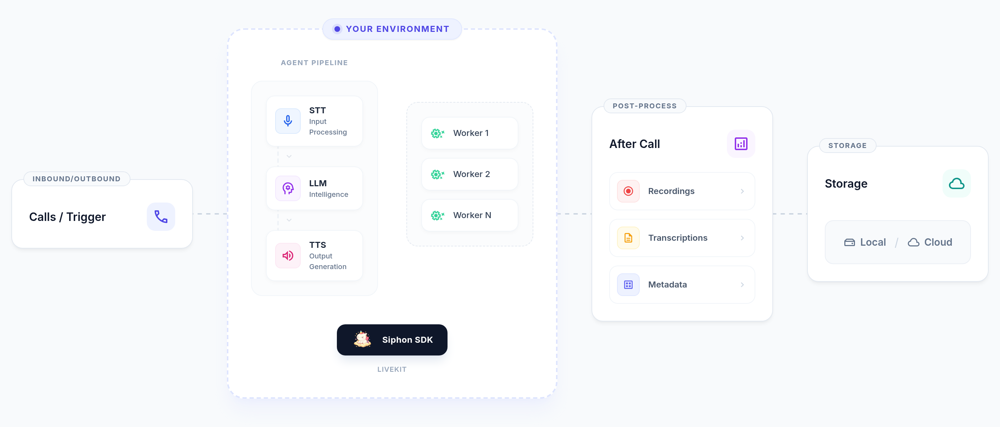

<p align="center">
  
</p>

<h1 align="center">SIPHON</h1>

<div align="center">

[](LICENSE)

**The Open Source Framework for Production AI Calling Agents**

*Build, test, and deploy human-like calling agents in a few lines of Python.*

### 🚀 Public Launch: January 17, 2026

[Website](https://siphon.blackdwarf.in) · [Report Issues](https://github.com/blackdwarftech/siphon/issues)

</div>

---

## ⚡ What is SIPHON?

Siphon is a developer-first, open-source framework designed to eliminate the complexity of building AI calling agents. Unlike closed ecosystems, Siphon gives you **full control** over your infrastructure, latency, and costs.

Stop paying platform fees. Start building on your own terms.

## ✨ Key Features

- **🐍 Python Native**: Built for engineers, not drag-and-drop users.
- **🔓 No Vendor Lock-in**: Swap LLMs (OpenAI, DeepSeek, Anthropic) and STT/TTS providers instantly.
- **⚡ Ultra-Low Latency**: Powered by LiveKit for real-time conversational speeds.
- **💸 Zero Platform Fees**: You pay for your compute and API usage, nothing else.
- **📈 Auto-Scaling**: Production-ready architecture designed for thousands of concurrent calls.

## ✔️ Quick Start Preview

Build a receptionist agent in just a few lines of code:

```python
from siphon.agent import Agent
from siphon.telephony import Dispatch

# Initialize your agent
agent = Agent(
    agent_name="receptionist",
    llm=openai_config,
    stt=deepgram_config,
    tts=elevenlabs_config
)

# Connect to telephony
Dispatch(agent_name="receptionist", sip_number="+1234567890")

# Go live
agent.start()
```

## System Overview

<p align="center">
  
</p>

## 📅 Roadmap

- **Now**: Internal Alpha testing.
- **Jan 17, 2026**: Public Source Release (v0.1.0).

## 🤝 Community

- **Star this repository** to get notified of the launch!
- Follow our progress on [Twitter/X](https://x.com/blackdwarf__).

## 📄 License

Siphon is open-source software licensed under the [Apache 2.0 License](LICENSE).
