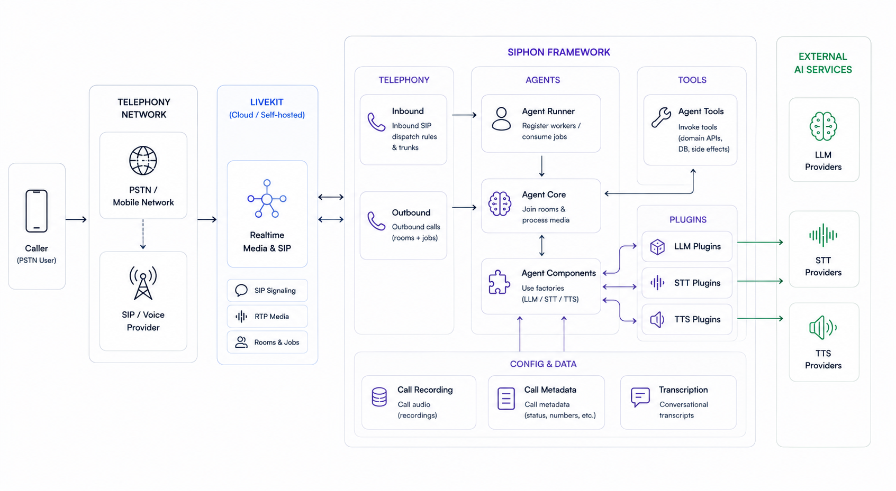

<div align="center">
  

  <h1>SIPHON</h1>
  
  <p><strong>The Open-Source Foundation for Production Voice AI.</strong></p>

  <p>
    <a href="https://pypi.org/project/siphon-ai/"></a>
    <a href="https://github.com/blackdwarftech/siphon/blob/main/LICENSE"></a>
    <a href="https://pepy.tech/projects/siphon-ai"></a>
    <a href="https://siphon.blackdwarf.in/docs"></a>
  </p>
</div>

> **Zero platform fees. BYOK. Your VPC. Your data. Your rules.** Siphon is the open-source infrastructure designed to help you build and scale your own AI calling system. 

Stop renting your core telephony stack from managed platforms (Eg: Vapi, Retell...etc). Bridge legacy SIP to modern LLMs over ultra-low latency WebRTC pipelines, and keep **100% of your margins**.

<div align="center">
  
</div>

## ⚡ Why Siphon?

Building real-time voice agents usually requires stringing together fragile WebSockets, managing complex SIP trunks, and handling unpredictable network jitter. Siphon abstracts the infrastructure nightmare so you can focus on agent logic.

- **The Open-Source Alternative:** Siphon provides the exact same sophisticated orchestration as expensive CPaaS wrappers, but you host it on your own servers. 
- **Sub-500ms Latency:** Powered natively by WebRTC and the LiveKit engine. No awkward pauses, no walkie-talkie effect.
- **Zero-Config Horizontal Scaling:** Run 1 worker or 1,000. It autonomously load-balances active voice sessions without complex Kubernetes HPA rules.
- **Enterprise Data Sovereignty:** Run it in your own VPC. Unredacted customer audio, transcripts, and metadata never leave your infrastructure.
- **Provider Agnostic (No Lock-in):** Swap between OpenAI, Anthropic, Deepgram, Cartesia, and local open-source models with a single line of configuration.

---

## 🚀 Quickstart: Your First AI Agent

Get a fully functional inbound AI receptionist running locally in less than 10 minutes.

### 1. Install Siphon
```bash
pip install siphon-ai
```

### 2. Configure Your Environment (`.env`)

Siphon requires LiveKit for the real-time media bridge and API keys for your chosen AI models.

```env
# LiveKit can be Cloud-hosted (LiveKit Cloud) or Self-Hosted on your own infrastructure
LIVEKIT_URL=wss://your-project.livekit.cloud 
LIVEKIT_API_KEY=your_api_key
LIVEKIT_API_SECRET=your_api_secret

OPENAI_API_KEY=sk-proj-...
DEEPGRAM_API_KEY=your_deepgram_key
CARTESIA_API_KEY=your_cartesia_key
```

### 3. Write Your Agent (`agent.py`)

Because Siphon abstracts the complex WebRTC media pipelines and VAD (Voice Activity Detection) natively, your code remains clean and declarative.

```python
import os
from dotenv import load_dotenv
from siphon import Agent
from siphon.plugins import openai, deepgram, cartesia

load_dotenv()

# Instantiate your models
llm_model = openai.LLM(model="gpt-4o")
stt_model = deepgram.STT()
tts_model = cartesia.TTS(voice_id="your-voice-id")

# Create the Agent
agent = Agent(
    agent_name="Receptionist",
    llm=llm_model,
    stt=stt_model,
    tts=tts_model,
    system_prompt="You are a helpful and professional enterprise AI receptionist. Keep your answers brief and conversational."
)

if __name__ == "__main__":
    # Download required models/dependencies (Uncomment and run this ONLY for the first-time setup)
    # agent.download()

    # Start the worker node (auto-connects to the Siphon dispatcher)
    agent.start()
```

### 4. Run & Talk!

```bash
python agent.py
```

*Your agent worker is now live!* **📞 Connect Your Telephony (Inbound & Outbound)**
Once your worker is running, you can natively bind your Twilio or Telnyx or Any SIP credentials to accept live calls or trigger programmatic outbound fleets. Check out our official documentation for the exact routing scripts:

* 👉 **[Inbound Setup (Receiving Calls)](https://siphon.blackdwarf.in/docs/calling/inbound/dispatch)**
* 👉 **[Outbound Setup (Making Calls)](https://siphon.blackdwarf.in/docs/calling/outbound/calls)**

---

## 🧠 Production Capabilities

Siphon is built for actual enterprise workflows, not just weekend prototypes:

* **Native Inbound Routing (Dispatch):** Dynamically route incoming calls to different specialized AI personas (e.g., Sales vs. Support) based on SIP headers and dialed numbers—no webhooks required.
* **Programmatic Outbound Fleets:** Trigger hundreds of context-aware outbound calls for appointment reminders and lead qualification via a simple Python API.
* **Asynchronous Tool Calling:** Connect your agent to Google Calendar, Postgres, or internal CRM APIs. Siphon executes actions mid-conversation without dropping the audio stream.
* **Stateful Memory:** Persist call metadata and transcripts natively to PostgreSQL or S3, giving your agents perfect cross-session recall when a customer calls back.
* **Advanced Interruption Handling:** Local VAD execution halts TTS audio instantly when a human speaks, recalculating context seamlessly.

## 📖 Documentation & Architecture

For deep dives into our SIP-to-WebRTC bridging, advanced VAD interruption handling, and deployment guides, visit our official documentation:

👉 **[Read the Full Siphon Docs](https://siphon.blackdwarf.in/docs)**

## 🤝 Contributing

We are building the open future of telephony. We welcome contributions for new AI provider plugins, latency optimizations, and documentation improvements.

Please see our [CONTRIBUTING.md](https://github.com/blackdwarftech/siphon/blob/main/CONTRIBUTING.md) for guidelines.

## ⚖️ License

Siphon is released under the [Apache 2.0 License](https://github.com/blackdwarftech/siphon/blob/main/LICENSE). Built with ❤️ by **BLACKDWARF**.

